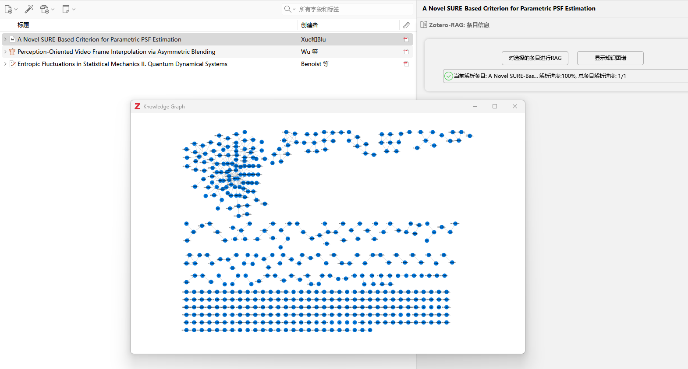

  # Zotero RAG

  ***
Embedding Retrieval Augmented Generation into Zotero to build a local knowledge base and improve Zotero reading efficiency.***

## Preview

  

## Thanks
- [Zotero Plugin Template](https://github.com/windingwind/zotero-plugin-template)
- [lightRAG-JS](https://github.com/windfollowingheart/LightRag-JS)
  
---

